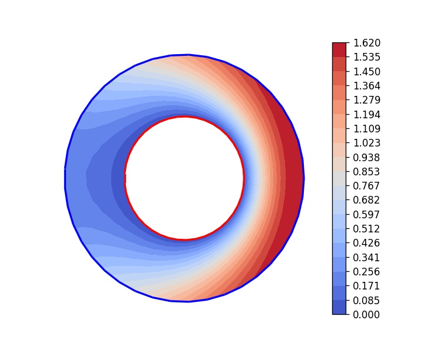
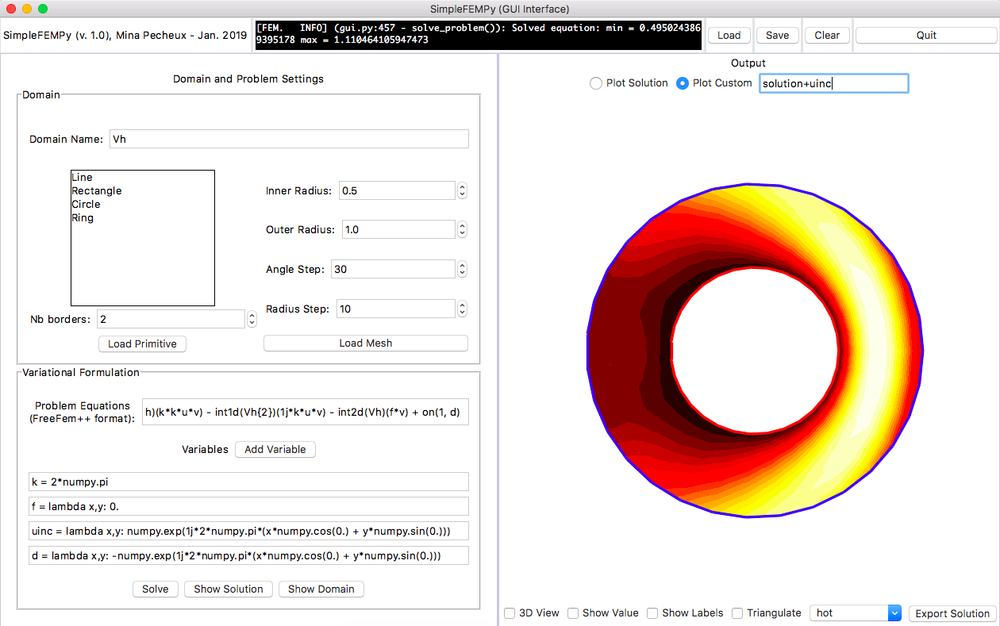

# SimpleFEMPy

SimpleFEMPy is a basic partial differential equations (PDE) solver that relies on the finite element method (FEM) to solve common problems in physics, mechanics, biology and many other fields.

<div style="width: 100%; display:flex; justify-content: center;">
  
</div>

## Context & Objectives
### What is the finite element method?
The study of PDEs is a fascinating field of mathematics with many concrete applications, be it in physics, mechanics, meteorology, medicine, urbanism... Mathematicians model the world as equations to better understand it and, if possible, compute a theoretical solution to a physical problem. However, we can’t always get an analytical solution – for example if the geometry is too complex – and sometimes must rely on numerical methods to get an approximation.

Partial differential equations can model a lot of phenomena we see in our daily lives: wave propagation (such as sound propagation or light diffusion), fluid dynamics, mechanical deformation, etc.. They are a powerful tool to analyze and predict the behavior of physical systems both in space and time.

The [finite element method](https://en.wikipedia.org/wiki/Finite_element_method) is a numerical method that helps us solve a lot of engineering problems like heat transfer, fluid flow... Its core idea is to find an approximation of the solution to a static (i.e.: time-independent) physical problem. To do so:
- we discretize our domain spatially in order to get an equivalent of our world with a finite number of points so we are able to ask a computer to work on the problem with us
- we then model our problem as a linear system
- we solve it to compute the solution at each point of our discretized domain

*Note: I am currently writing a series of article on my website on the FEM to explain more of its concepts. Don't hesitate to check it out [over here](http://minapecheux.com/wp/solving-pdes-numerically-the-finite-element-method-1/)!*

### My goals with SimpleFEMPy
This year, I took a course on the FEM at my school of Engineering, taught by [Bertrand Thierry](https://www.ljll.math.upmc.fr/bthierry/), that really fascinated me! This library was, at first, my contribution to the final project we had to do for the course. But I dived more into the concepts and took it as a chance to start to develop a small library in Python, called SimpleFEMPy, to solve PDEs with the finite element method. It is far from being complete, but it already shows some promise.

It takes a lot after [FreeFem++](https://freefem.org/), an open-source finite element software developed by researchers from the french university Paris Sorbonne. It is very efficient and compatible with many usual tools in the domain, for example mesh generators like [GMSH](http://www.gmsh.info/) or scientific visualization software like [Paraview](https://www.paraview.org/). SimpleFEMPy is not as powerful as FreeFem++ but tries to provide the user with the same sort of working pipeline. In particular, it allows GMSH mesh files (version 2.2) imports and CSV or VTK (Paraview's format) exports.

For this first version of the library, my objectives were to:
- allow the user to solve most of the usual problems that can be treated with the FEM
- offer one a simple interface and even a small graphical interface
- also offer a range of small useful tools to help master the library
- analyze the library's performance
- write up code documentation and try to follow a common Python-philosophy to prepare for an open-source development of the project
- think about the updates, upgrades and new features SimpleFEMPy could benefit from

## Install and test SimpleFEMPy
SimpleFEMPy is a Python package that can be used directly by copying it into your working directory *(it is not yet available via ``pip``, sadly)*. To use the library, simply download the repository.

After you unzip it, you will get a folder with two Python scripts (``demo.py`` and ``gui.py``), the library folder ``simplefempy/`` and some ``doc/`` and ``resources/`` folders.

To easily have all the required libraries, you can install and run the prepared Pipenv environment with the following commands:

```
pipenv install
pipenv shell
```


### TL;DR (command line)
Go into the unzipped folder and run the ``demo.py`` script with the following command-line:

```
python demo.py
```

Then follow the instructions!

### TL;DR (graphical interface)
Go into the unzipped folder and run the ``gui.py`` script with the following command-line:

```
python gui.py
```

Then, click on the "Load" button at the top of the window and load one of the SimpleFEMPy state file (a .sfpy file) provided in the ``resources/`` folder of the library.

### Writing up your own script
To show how the library works, let's take an example: the acoustic diffraction of a wave on a relatively simple geometry.

We consider a ring that has two borders: the interior circle and the exterior circle and we want to solve the following equation (called the Helmholtz equation): &Delta;u + k<sup>2</sup>u = 0.

To solve this problem, we will proceed in 4 steps:

- we define our discrete domain V<sub>h</sub>
- we define our variational formulation (with the two conditions on the borders &Gamma; and &Gamma;<sup>&infin;</sup>)
- we solve the problem
- we display our solution and contemplate the result!

I am not going to go into all the mathematical details but I'll give some pointers for the ones into maths. Otherwise, you can skip the following part and simply look at the code below.

**The mathematical theory**

Our equation is a second order (in space) static equation, with no source. Since it cannot be set by an initial condition, the unicity of our solution comes from the border conditions we specify on our two borders.

Let's call our domain &Omega;. Its complete border is &part;&Omega; that can be cut down into the interior part &Gamma; and the exterior part &Gamma;<sup>&infin;</sup> such that: &part;&Omega; = &Gamma; &cup; &Gamma;<sup>&infin;</sup>.

Now, we'll consider the following border conditions:

- a Dirichlet condition on the interior border (&Gamma;): u = -u<sub>inc</sub>
- a Fourier-Robin condition on the exterior border (&Gamma;<sup>&infin;</sup>): &part;<sub>n</sub>u + iku = 0

SimpleFEMPy relies on the Galerkin method and the use of [variational (or weak) formulations](https://en.wikipedia.org/wiki/Weak_formulation). This way, we allow ourselves to search for solutions that are a bit "more gentle" (from a mathematical point of view) but approximate the behavior of the real solution well.

To transform a "classical" equation like the one above into its weak formulation, we multiply it by a "test function" and integrate it over our domain &Omega;. Various mathematical formulas like [Green's theorem](https://en.wikipedia.org/wiki/Green%27s_theorem) can then be used to simplify a few things.

For example, here, we have:

&int;<sub>&Omega;</sub> &Delta;u.v + k<sup>2</sup>&int;<sub>&Omega;</sub> u.v = &int;<sub>&Omega;</sub> 0 . v<br />
&hArr; -&int;<sub>&Omega;</sub> &nabla;u . &nabla;v + &int;<sub>&part;&Omega;</sub> &part;<sub>n</sub>u.v + k<sup>2</sup>&int;<sub>&Omega;</sub> u.v = 0 *(with Green's theorem)*<br />
&hArr; -&int;<sub>&Omega;</sub> &nabla;u . &nabla;v + (&int;<sub>&Gamma;</sub> &part;<sub>n</sub>u.v + &int;<sub>&Gamma;<sup>&infin;</sup></sub> &part;<sub>n</sub>u.v) + k<sup>2</sup>&int;<sub>&Omega;</sub> u.v = 0 *(because &part;&Omega; = &Gamma; &cup; &Gamma;<sup>&infin;</sup>)*<br />
&hArr; -&int;<sub>&Omega;</sub> &nabla;u . &nabla;v - ik&int;<sub>&Gamma;<sup>&infin;</sup></sub> u.v + k<sup>2</sup>&int;<sub>&Omega;</sub> u.v = 0 *(by applying our border conditions)*<br />

This weak formulation should now be studied not on &Omega; itself but rather on its discrete equivalent. This space of finite dimension is often called V<sub>h</sub> and is basically created by mapping a discretization lattice over &Omega; (either a regular grid or a triangulation) and only taking into account the vertices of this lattice for our computations.

In the end, we find that the variational formulation associated with our problem is:

*Find u &in; V<sub>h</sub> such that:<br />
u = -uinc (&Gamma;)<br />
&forall; v &in; V<sub>h</sub>,  -&int;<sub>&Omega;</sub> &nabla;u . &nabla;v + k<sup>2</sup>&int;<sub>&Omega;</sub> u.v - ik&int;<sub>&Gamma;<sup>&infin;</sup></sub> u.v = 0*

**The implementation in SimpleFEMPy**

The script uses the well-known ``NumPy`` scientific Python library, and it imports several objects from SimpleFEMPy. Take a look at the final script below to see the import part (I won't bore you with the list for now).

To create our discrete domain we use the following line:

```python
# define discrete domain
Vh = DiscreteDomain.ring(0.5, 1.0, astep=40, rstep=20, nb_borders=2,
        labels={ 'Omega': 10, 'GammaInt': 1, 'GammaExt': 2 })
```

The ``astep`` and ``rstep`` parameters are optional, but they give us a much smoother geometry. The ``labels`` parameter allows us to assign clearer names to the different parts of our geometry (the surface or the borders).

Then to create the variational formulation to solve, we define a few useful variables and the problem we translated into a weak formulation above:

```python
# define useful variables
k     = 2*np.pi
alpha = 0.
f     = lambda x,y: 0.
uinc  = lambda x,y: np.exp(1j*k*(x*np.cos(alpha) + y*np.sin(alpha)))
d     = lambda x,y: -uinc(x,y)

# prepare variational formulation
Problem = VariationalFormulation.from_str(
    'u,v:-int2d(Vh)(grad{u}*grad{v}) + int2d(Vh)(k*k*u*v)' \
    '- int1d(Vh{GammaExt})(1j*k*u*v) - int2d(Vh)(f*v)' \
    '+ on(GammaInt, d)', locals()))
```

Finally, to solve and display the result we need two more lines:
```python
# solve equation
u = Problem.solve()
# plot result
plot(Vh, u)
```

However, in this particular case, it is more interesting to visualize the sum of our solution with the u<sub>inc</sub> function. To do so, just modify the end of the script:

```python
# solve equation
u = Problem.solve()
# plot result
sol = u+uinc(*Vh.points) # sample uinc on all vertices of Vh and add to u
plot(Vh, sol)
```

Here is the final script:
```python
import numpy as np
from simplefempy.discretizor import DiscreteDomain
from simplefempy.solver import VariationalFormulation
from simplefempy.utils.misc import plot

# define discrete domain
Vh = DiscreteDomain.ring(0.5, 1.0, astep=40, rstep=20, nb_borders=2,
        labels={ 'Omega': 10, 'GammaInt': 1, 'GammaExt': 2 })

# define useful variables
k     = np.pi
alpha = 0.
f     = lambda x,y: 0.
uinc  = lambda x,y: np.exp(1j*k*(x*np.cos(alpha) + y*np.sin(alpha)))
d     = lambda x,y: -uinc(x,y)

# prepare variational formulation
Problem = VariationalFormulation.from_str(
    'u,v:-int2d(Vh)(grad{u}*grad{v}) + int2d(Vh)(k*k*u*v)' \
    '- int1d(Vh{GammaExt})(1j*k*u*v) - int2d(Vh)(f*v)' \
    '+ on(GammaInt, d)', locals())

# solve equation
u = Problem.solve()
# plot result
sol = u+uinc(*Vh.points) # sample uinc on all vertices of Vh and add to u
plot(Vh, sol)
```

If everything goes according to plan, when you run your script, a window should pop up with this image:



If it's the case, congratulations: you have just written and executed your first SimpleFEMPy script!

### Solving the same problem through the graphical interface
Let's try to solve the same problem using SimpleFEMPy's graphical interface. Basically, we'll just put the right thing at the right place, but there won't be anything new compared to the previous part.

The library's graphical interface consists of 3 parts:

- a menu bar at the top of the window
- a left panel to define your discrete domain and the problem to solve
- a right panel to visualize your solution

To solve our acoustic diffraction problem, we'll follow the same reasoning as before and start by defining our discrete domain V<sub>h</sub>. This is done in the left panel, in the top section labeled "Domain".

For now, leave the domain name as is: "Vh". Below, select the "Ring" primitive and change some parameters:
- below the list of available primitives, set the "Nb borders" field to 2
- on the right, set "Angle Step" to 40 and "Radius Step" to 20

Click on the "Load Primitive" button: you should visualize the domain in the right panel with the surface and its two borders.

Now, let's define our variational formulation. Go to the bottom part of the left panel, labeled "Variational Formulation", and in the first field "Problem Equations" enter the string that defined our Helmholtz equation in its weak form:

```
u,v:-int2d(Vh)(grad{u}*grad{v}) + int2d(Vh)(k*k*u*v) - int1d(Vh{2})(1j*k*u*v) - int2d(Vh)(f*v) + on(1, d)
```

*(This time, we can't rename our borders and must use their predefined labels "1" and "2"...)*

Finally, take a look at the "Variables" section below. Here, we'll set the various variables we use in our weak formulation so SimpleFEMPy knows their value when solving the problem.

Click on the "Add Variable" button 4 times and complete each field with one of these lines:

```
k = 2*numpy.pi
f = lambda x,y: 0.
uinc = lambda x,y: numpy.exp(1j*2*numpy.pi*(x*numpy.cos(0.) + y*numpy.sin(0.)))
d = lambda x,y: -numpy.exp(1j*2*numpy.pi*(x*numpy.cos(0.) + y*numpy.sin(0.)))
```

**Warnings:**
- *The variables you define in the "Variables" section are all created at the same time by the library when you solve your problem. Thus, you can't reuse one in another. For example, here, you can't define ``alpha`` first then reuse it in the ``uinc`` and ``d`` functions below.*
- *The ``NumPy`` library is imported but not renamed so you **must** use its complete name ``numpy`` and not ``np`` like before.*

You're done! To solve the problem, just click on the "Solve" button. The result will appear in the right panel and replace the "flat" domain you were seeing so far.

Like I said in the previous part, here, it is more interesting to visualize the sum of our solution with u<sub>inc</sub> than the solution on its own. No worries, it's not difficult to change!

In the right panel, at the top, just select the "Plot Custom" option and in the text field on its right enter:

```
solution + uinc
```

And click on the "Show Solution" button at the bottom of the left panel to get your new image.

A few remarks about the "Plot Custom" field:

- You can only use "solution" or the name of a variable defined in the "Variables" section in this field.
- The word "solution" in this field automatically refers to the computed solution (therefore, it should not be used as a variable name!).

Here is a screenshot of the interface in its final state:



Don't hesitate to play around with the display options to dive more into the interface!

Moreover, if you want to save the current session or load an old one, you can use the "Load" and "Save" buttons at the top of the window. SimpleFEMPy uses its own state file format (a .sfpy file) to store all the data and easily restore a complete working session instantly. Some state files are provided in the ``resources/`` to help you get started.

## Compatibilty Issues

For now, SimpleFEMPy is meant to work with the latest Python 3 versions (> 3.5). Although it should work with Python 2, backward compatibilty is not guaranteed.

However, the GUI interface requires official Python releases >= 3.7.1 because of Matplotlib and Tkinter conflicts in the previous versions, and in the current Homebrew Python 3.7 keg. Make sure to download and install your Python release from the [Python official website](https://www.python.org/downloads/) if you wish to use The GUI interface.
